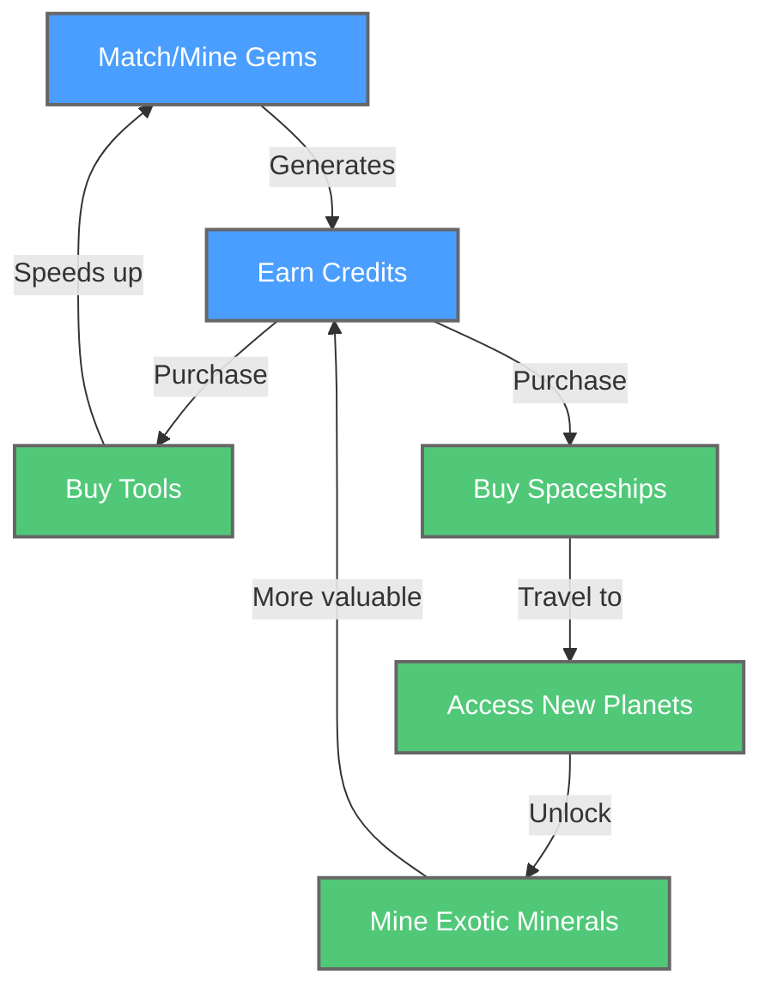

This is a Unity 6 match 3 PC game for Steam  that I am developing using as much AI as I possibly can.
You can download the free game from Steam: https://store.steampowered.com/app/3412990/SpAIceRocks/

I'm building a video series on the effort: https://www.youtube.com/watch?v=xodknbWptZo&list=PLFUWlfd8IyFU_aLpT_mx_n4ktZFoeqfrJ

I am using:
- Game logic generated from Cline (VSCode plugin) + Claude AI  & Unity Muse
- Muse under beta, but I'm not able to speak about it at the moment.
- Graphics from Midjourney (paid subscription) processed with Rembg
- Music from Udio
- Sound effects from https://www.optimizerai.xyz/ and https://freesound.org/ (non-AI)
- Font suggestions from a mixture of experts with ChatGPT's and Claude's suggestions winning out so far.
- Special effects from Unity Particle Pack (non-AI)

Thank you to all the awesome providers above!

I've also explored a couple other solutions, and I go to ChatGPT and Gemini when I want a different take on a problem.
This work is very much a work in progress.  Not all funcationality is nice or complete yet. 
-Chris

Character Progression:

