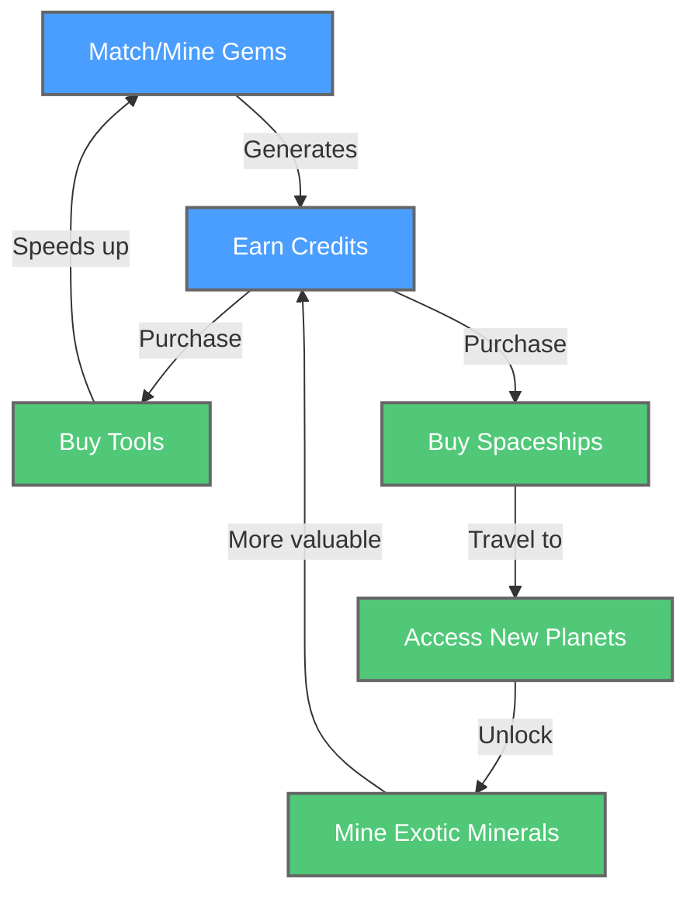

This is a Unity 6 match 3 PC game for Steam  that I am developing using as much AI as I possibly can.

As of 10/28/2024, I have not started blogging/vlogging about it, but I will soon.
For now, I am using:
Claude APi with Cline VS Code plugin, so I can have Claude right in the editor.
Muse under beta, but I'm not able to speak about it at the moment.
Midjourney under the paid subscription for asset generation.
A python file that uses AI to remove the backgrounds from the Midjourney assets.
Udio.com for the background audio. 
Claude for the game design doc.

I've also explored a couple other solutions, and I go to ChatGPT and Gemini when I want a different take on a problem.
This work is very much a work in progress.  Not all funcationality is nice or complete yet. 
-Chris

Characater Progression:

